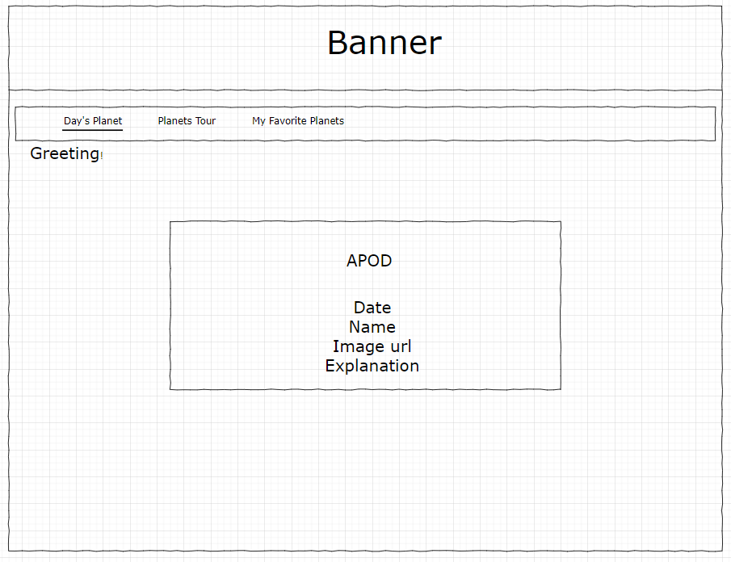
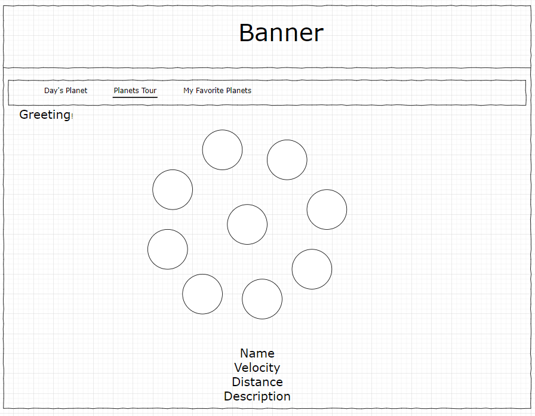
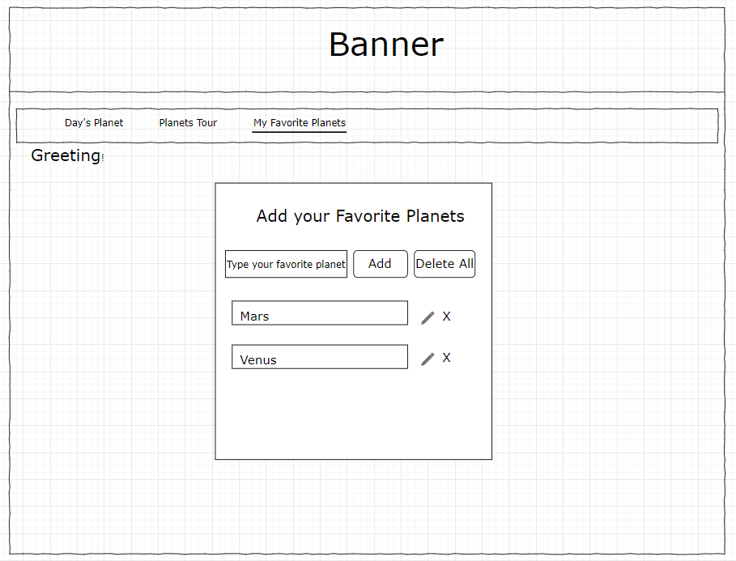
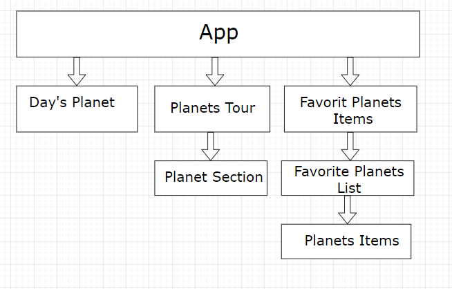

# Project-2 The Galaxy World

## Table of Contents
1. [Project Discribtion](#Project-Discribtion)
2. [Technologies](#technologies)
3. [WireFrames](#WireFrames)
4. [Components Structure](#Components-Structure)
5. [Development Process](#Development-Process)
6. [Future Goals](#Future-Goals)
7. [Final Result](#Final-Result)
8. [References](#References)
### Project Discribtion
***
The Galaxy World is a mini world project for either those who interested in the solar system and galaxy or those who want to know more about the field, which gives the user an insightful special tour with the ability to have the APOD from NASA API. The user will be able to navigate between the planets for more details, with an ability to let the user have his own favorite planets list, updating the list, toggle between favorite & unfavorite, and remove them as well. mainly used the hook with useState and useEffect and different technologies to be illustrated in the next sections.


## Technologies
***
A list of technologies used within the project:
| Name | Intallation | Used for? | Reference|
| ------ | ------ | ------ | ------ |
| React | ```npx create-react-app``` | Creating the app |[Creating React App](https://reactjs.org/docs/getting-started.html)
| axios |```npm install --save axios``` |For fetch a data from an API call, I used NASA API to fetch [APOD](https://api.nasa.gov/) |[Install the axios](https://www.npmjs.com/package/axios)
| env File |```npm install --save dotenv``` |Used to secure your API key|[Install the file ](https://www.npmjs.com/package/axios)
| Planet Package |```npm install react-planet```|Allows you to have a customizable circular menu|[Install th planet package](https://innfactory.de/softwareentwicklung/ui-ux/creating-circular-menus-with-react-planet/)
| React Router |```npm install react-router-dom``` |To navigate between the components|[Install the package](https://reactrouter.com/web/guides/quick-start)
| Bootstrap | ```npm install react-bootstrap ``` |Add styling to the app, I used it for the NavMenu|[Install Bootstrap](https://getbootstrap.com/docs/4.0/getting-started/download/)

## WireFrames
***




## Components Structure
***
The Components Structure to clarify the passing props process.



## Development Process
***
Starting with creating the wireframes and the structure of the components to visualize the final result and simplify the development process, it will help of doing the requirements by breaking the problem into smaller parts and solve it one by one until all the required requirements are met.

## Future Goals
***
- Add another API call to fetch more data.
- Add dropdown menu/ form validation to the list
- Add more section to give a good UX.
- make it bigger! a real galaxy world.

## Final result
***


## References
***
- [NASA API](https://api.nasa.gov/)
- [APOD](https://apod.nasa.gov/apod/astropix.html)
- [React Hook](https://reactjs.org/docs/hooks-intro.html)